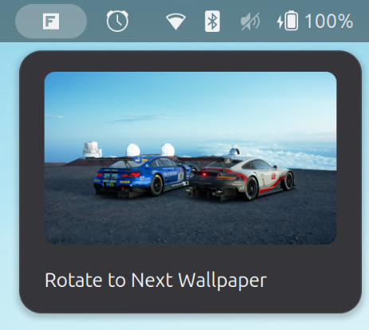

# Fresco

Fresco is a native GNOME wallpaper manager for building a personal image
collection and rotating your desktop background automatically.


*Fresco wallpaper collection*

## What it does

- Import, browse, crop, re-crop, and remove wallpapers.
- Apply a wallpaper immediately or rotate to another one manually.
- Rotate automatically with a configurable `systemd --user` timer, even when
  the app is closed. Persistent timers catch up after the system resumes.
- Optionally rotate to the next wallpaper from the GNOME Shell top bar.

## Requirements

- GNOME 45 or newer
- GTK 4 and libadwaita 1
- Python 3 with PyGObject and GdkPixbuf
- Meson and Ninja
- `systemd --user` for automatic rotation

## Linux platform support

Fresco is designed for Linux systems running GNOME 45 or newer. It should be
workable in theory on distributions such as Fedora, Ubuntu, Debian, Arch
Linux, openSUSE, and other distributions that provide the required GNOME,
GTK, Python GI, and systemd packages.

The published `.deb` package is intended for Debian-based distributions. On
other distributions, build Fresco from the source archive or a Git checkout.

## Release 0.3.0

The latest release is available on the [Fresco releases page](https://github.com/A5CENSION-SRT/Fresco/releases).

- Debian package: `fresco_0.3.0-1_all.deb`
- Source archive: `fresco_0.3.0-1.tar.xz`

To install the Debian package:

```sh
sudo apt install ./fresco_0.3.0-1_all.deb
```

To extract the source archive:

```sh
tar -xf fresco_0.3.0-1.tar.xz
cd WallPana
```

## Install from a Debian package

Download the Debian package from the [Fresco releases page](https://github.com/A5CENSION-SRT/Fresco/releases), then install it with:

```sh
sudo apt install ./fresco_0.3.0-1_all.deb
```

Start Fresco from the application launcher or run:

```sh
fresco
```

## Build from source

Install the GTK 4, libadwaita, GObject Introspection, GdkPixbuf, and Python GI
development packages for your distribution. Then build and install Fresco:

```sh
meson setup build --prefix="$HOME/.local"
meson compile -C build
meson install -C build
```

Ensure `~/.local/bin` is on your `PATH`, then start the app:

```sh
fresco
```

## Automatic rotation

Fresco enables the rotation timer the first time it starts. Open Preferences
to choose an interval from 1 hour to 7 days, or to turn automatic rotation on
or off. The timer runs as a user service and does not require the application
window to remain open.

## GNOME Shell extension

The optional extension adds a top-bar menu for rotating to the next wallpaper.
It is installed with the main Meson build.



*Fresco GNOME Shell extension*

Enable it after installing Fresco:

```sh
gnome-extensions enable fresco@snehal-reddy.github.io
```

Launch Fresco once before using the extension. If it does not appear
immediately, restart GNOME Shell or log out and back in.

## Data storage

Fresco stores data in standard per-user directories:

- Wallpaper files: `~/.local/share/fresco/wallpapers/`
- Original images used for re-cropping: `~/.local/share/fresco/wallpapers/.originals/`
- Configuration and wallpaper order: `~/.config/fresco/config.json`

Wallpapers are applied through GNOME's desktop background settings. The same
wallpaper is used across all monitors, with GNOME handling the final scaling.

## Status

Fresco is an early release. Wallpaper changes are immediate, and crop settings
are shared across monitors rather than configured per display.

## License

Fresco is free software licensed under the GNU General Public License,
version 3 or later. See [COPYING](COPYING) for the full license text.
