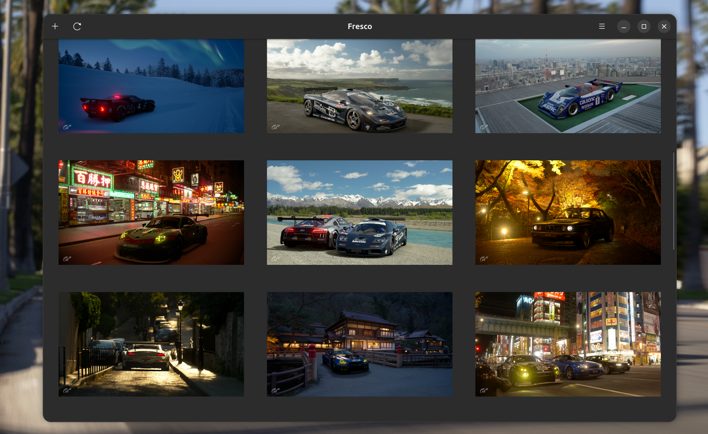

# Fresco

Fresco is a native GNOME wallpaper manager. Keep a personal collection of
images, crop them before applying, switch wallpapers from the app, or let
Fresco rotate your desktop background automatically on your schedule.



## Features

- Import, remove, and browse wallpapers in a thumbnail grid.
- Crop new wallpapers and re-crop them later from their original images.
- Apply any wallpaper immediately or rotate to another one manually.
- Rotate automatically with a configurable `systemd --user` timer, even when
  the app is closed. Missed rotations run after the system resumes.
- Optionally control Fresco from the GNOME Shell top bar with the included
  extension.

## Requirements

- GNOME 45 or newer
- GTK 4 and libadwaita 1
- Python 3 with PyGObject and GdkPixbuf
- Meson and Ninja
- `systemd --user` for automatic rotation

## Build and install

Install the platform development packages for GTK 4, libadwaita, GObject
Introspection, GdkPixbuf, and Python GI using your distribution's package
manager. Then build Fresco with Meson:

```sh
meson setup build --prefix="$HOME/.local"
meson compile -C build
meson install -C build
```

Make sure `~/.local/bin` is on your `PATH`, then start the app:

```sh
fresco
```

The automatic rotation timer is enabled when Fresco is first launched. Its
interval can be adjusted from 1 hour to 7 days in the preferences dialog, and
the timer can be turned on or off there as well.

## GNOME Shell extension

The optional extension adds a top-bar menu for rotating to the next Fresco
wallpaper. It is installed with the main Meson build.

Enable it after installing Fresco:

```sh
gnome-extensions enable fresco@snehal-reddy.github.io
```

Launch Fresco once before using the extension so its wallpaper collection and
D-Bus actions are available. Restart GNOME Shell or log out and back in if the
extension does not appear immediately.

## Data storage

Fresco stores its data in standard per-user directories:

- Wallpaper files: `~/.local/share/fresco/wallpapers/`
- Original images used for re-cropping: `~/.local/share/fresco/wallpapers/.originals/`
- Configuration and wallpaper order: `~/.config/fresco/config.json`

Wallpapers are applied through GNOME's desktop background settings. The same
wallpaper is used across all monitors, with GNOME handling the final scaling.

## Project status

Fresco is an early release. Wallpaper changes are immediate, and cropping is
currently shared across monitors rather than configured per display.

## License

Fresco is free software licensed under the GNU General Public License,
version 3 or later. See [COPYING](COPYING) for the full license text.
